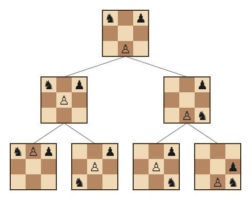
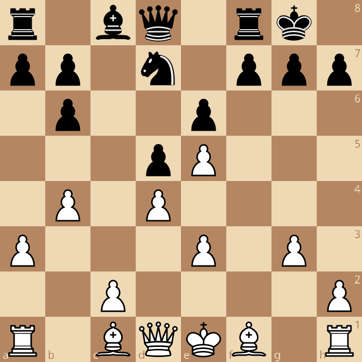

If you want to try playing the bot before reading about how it works, [you can do so here](https://lichess.org/@/ConfidenceBuilder).

# Background

I should point out before anything else that I am not a good chess player. I don't have the self-control not to just jump at the first move that looks good, and have no interest in taking the time to do things like memorize openings. I do occasionally solve chess puzzles, but that's my love of puzzles overpowering my indifference towards chess.

However, like text justification or cellular automata, I think most everyone with an interest in computer science gets pulled towards it eventually, and this is the result of that experience for me.

A while back I downloaded the [lichess](https://lichess.org/) app and made an account. I figured it was as good or better than the other puzzle games I have on my phone, and certainly with a lot more depth. However, while I could beat the computer mode on the easiest setting, it felt like its mistakes were obvious, and deflated any sense of accomplishment from winning. Unfortunately, even bumping it up a couple of levels left me out of my depth and unable to win more than an occasionally lucky game.

Thus, my goal in short: why get better at beating the computer when I can make the computer better at losing to me?

# Chess Engines

Writing a program to play chess is a wonderful problem as the premise is about as clean of a starting point as you could imagine, but the implementation goes as deep as you want to take it.

Chess only requires players to make one move at a time. This means the goal of a chess-playing program is simple: take the current state of the game, look at the legal moves available, and select the best move. Encoding the state of the game is simple enough (though there are many optimizations that exist) and identifying legal moves is just following some basic logic rules, so the crux of the challenge comes down to the third step of identifying what makes a move good or bad.

## Heuristics

The simplest approach would be to just design a metric for the state of the board which defines whether it is good or bad for a given player. For example, how many pieces does each player have remaining? Which pieces are they? Are they in favorable positions? These can give a rough estimate of the quality of a position (and thus a move leading to that position), and taken to the extreme can produce surprisingly good results. However, it's challenging to measure the quality of a current position without considering the board not just how it *currently* is, but how it likely *will* be in the future.

## Game Trees

Heuristics applied to a snapshot of the board are a fundamental piece of the puzzle, but to more accurately assess the quality of a state, it's necessary to project into future states to identify the long-term affects of an immediate decision.

To model this, we can use a Game Tree. Here, each node of the tree represents a state of the game, where the descending branches represent the possible moves that can be taken and their corresponding future states.

{: style="max-width: 400px"}

Instead of assessing a single move's result, we look at what the resulting state will be after the opponent takes their next turn (and when we take our next turn, and the opponent theirs, and so on). Since we don't know what our opponent will do on their turn, we plan for the worst and assume they will play whatever puts us in the least favorable position. This is the core idea behind the [minimax](https://en.wikipedia.org/wiki/Minimax) approach.

Since chess games can be easily be dozens of turns long, it's infeasible to search all the possible moves in the tree. Instead we take advantage of things like:

- Focusing our search on branches of the tree that appear to be more likely to occur.
- Skipping over branches we know would be poor choices (since we're looking to optimize our selection)
- Capping the depth of our search and falling back to our heuristic approach of assessing that state's quality.

## Current Engines

Modern chess engines follow roughly the approach described above. They're incredibly efficient, running on reasonably common hardware, and are good enough to beat the best human chess players.

I am not among the best human chess players. I probably wouldn't even qualify as a bad chess player, as that implies that you have enough experience to assess your performance. This makes creating a chess-playing program suitable for myself a much more interesting challenge: how do you make it suck *just* the right amount?

# How to Make it Bad?

Before trying my hand at creating a bot to play against, I learned a bit about what the common approaches to weakening computer play consist of. I found three main approaches that different engines used to adjust their level of performance for different human opponents:

1. **Use the same approach as a good engine, but limit it.** A good engine searches deeply through the game tree and applies an accurate heuristic once it reaches its defined depth. To weaken this, we can do things like limit the max depth it's allowed to search, limit the total amount of time/processing power available, or use a sub-optimal heuristic.
2. **Use the same approach as a good engine, but make a bad decision.** If a good engine identifies the relative quality of each move, it's trivial to then just *not* make the best move. There are different deterministic or stochastic approaches, but the idea is the same: some portion of the time, pick moves you know to be not in your best interest.
3. **Make it more human.** Incorporate into your algorithm the specific types of approaches that humans take to playing. Things like over-eagerly taking your opponent's pieces, or missing moves from far across the board.

This third approach is particularly interesting to me, as it implies something about the nature or quality to the play, as opposed to just the quantitative value. The approach I ended up taking encorporated a bit of this, but was mostly focused on a unique implementation of the second idea.

# The Algorithm

My approach took its core from a 1996 paper "Tutoring Strategies in Game-Tree Search" by Iida et al (though I deviated enough that "inspired by" might be more appropriate). In the paper (and a 1993 paper "Potential Applications of Opponent-Model Search") the authors discuss the scenario of an expert player intentionally losing to a beginner as a form of motivation and education. They discuss three search strategies:

**Opponent-Model Search** - Rather than assume your opponent will play optimally, when descending down the game tree, use a more accurate model of your opponent's behavior. This can lead to potentially better outcomes than the strict minimax approach.

**Loss-Oriented Search** - Using the same predicted opponent behavior as in Opponent-Model Search, select the move that weakens your own position, in an attempt to intentionally lose the game.

**Tutoring Search** - As with Loss-Oriented Search, chose moves that weaken your own position, but lower bound the allowed quality of your moves by your opponent's assessment of their quality. The effect of this is playing moves that are as bad as you can, but that your opponent will not identify as being errors.

While my implementation ended up a fair bit different to the Tutoring Search as defined in the paper, the idea resonated with what I was hoping to build. While there are plenty of chess engines weak enough that I can beat them, it ruins the illusion when it makes a move that I can identify as a mistake. I want an engine that I'm able to beat, but that I couldn't tell you afterwards why I was able to win.

# Implementation

While I love the idea of including an opponent model's assessment in the search, actually implementing that presented two problems I wasn't able to overcome:

1) I don't know how to create a model that has the same flawed assessment of game state as myself. Note, not a similarly poor assessment, but the *same* poor assessment.
2) Even if I had one of these models, it would mean building the game tree search algorithm from scratch, since existing programs aren't built for combining multiple models.[^lazy]

Instead, I took inspiration from the idea but modified the implementation. My version does still use two models:

* Stockfish: The preeminent open source chess engine, which uses the rough game tree search approach described above. It's incredibly fast and accurate, so I treated this as an oracle to determine the real quality of any move.
* Maia: a pure neural network approach which was trained off of human play. It doesn't assess the quality of a given move, but simply outputs the likelihood that a human player would play each move in the current game state.

While I didn't have a way to determine if the human opponent would identify the intentional errors the bot was making, I could use Maia's output as a proxy: if a human player would play this move with reasonable probability, that's presumably because they weren't able to identify it as being a mistake. In other words, if they would be likely to play it themselves, they'd be unlikely to spot it as an error if the engine played it.

This gives us the core of the algorithm:

> Play intentionally poor moves (as assessed by stockfish), but restricted to moves that surpass a certain likelihood that a human player would make the same choice (as predicted by maia).

## Example

For a more thorough understanding, let's walk through an example. The board below shows the state of a game I played against the bot where it was the bot's turn, playing as black.

{: style="max-width: 600px"}

The first stage of the process is to have stockfish assess all the available moves and quantify the resulting game state (as measured in centipawns, `cp`, where higher is good for the bot). Since this is running on inexpensive hardware and I wanted it to be fast for testing, I limited stockfish to selecting only the top 15 moves, which doesn't affect the following steps very much.

These moves are then assessed by Maia to identify the probability that a human player would play each of them (`maia_p`). This results in the following table:

| move | cp | maia_p |
|------|-----|-------|
| f7f6 | 64 | 0.2783 |
| b6b5 | -56 | 0.0326 |
| d8e8 | -58 | 0.0060 |
| d8e7 | -60 | 0.0380 |
| d8c7 | -61 | 0.0513 |
| a7a6 | -62 | 0.1592 |
| a7a5 | -64 | 0.1360 |
| h7h6 | -90 | 0.0271 |
| a8b8 | -102 | 0.0063 |
| d7b8 | -103 | 0.0294 |
| f7f5 | -111 | 0.0681 |
| f8e8 | -112 | 0.0224 |
| d8g5 | -113 | 0.1064 |
| g7g6 | -113 | 0.0130 |
| g8h8 | -131 | 0.0043 |

As the table shows, the best choice is to move the pawn at f7 to f6. This is also what Maia predicts a human to select the plurality of the time.

The next step is to filter out any moves that would be highly unlikely for a human to play. To do this we set a threshold value, $ε$, and discard any moves that are predicted for a human to play with less than that probability. With an $ε$ value of $0.05$, the only allowed moves would be: f7f6, d8c7, a7a6, a7a5, f7f5, and d8g5.

To actually select the move, we use each of their predicted `cp` values to calculate their probability of being chosen by the bot, weighting towards worse moves but not deterministically selecting the worst option every time.

$$\text{Weight} = e^{-T \cdot \frac{\text{cp}}{100}}$$

Where $T$ is an adjustable temperature constant. This produces the following weights and probabilities for being selected:

| move | cp | maia_p | weight | selection_p |
|------|-----|-------|---|---|
| f7f6 | 64 | 0.2783 | 0.527 | 4.3% |
| d8c7 | -61 | 0.0513 | 1.840 | 15.0% |
| a7a6 | -62 | 0.1592 | 1.859 | 15.2% |
| a7a5 | -64 | 0.1360 | 1.896 | 15.5% |
| f7f5 | -111 | 0.0681 | 3.034 | 24.8% |
| d8g5 | -113 | 0.1064 | 3.096 | 25.2% |

Note that it does still have a ~5% chance to play the optimal move, but the probability to make a serious error (150 cp worse than optimal) has gone up from ~15% to ~50%.

What we wind up with is a bot which plays intentionally poorly by taking plausible mistakes and turning them into likely mistakes. Anecdotely, this has a wonderful effect as a player of never noticing any particular mistakes that the bot is making, but conveniently winding up in favorable positions.

# Tweaks & Details

While the above outlines the core of how the bot determines its moves, here are a few more details for the curious:

- The ε value is dynamic. As the play progresses, it uses the cached search to measure the quality of the opponent's response. If they're responding well, ε is raised and the bot will play closer to the raw Maia predictions. If the opponent isn't taking advantage of the bot's mistakes, it lowers ε and makes more obvious errors.
- After some testing, it was clear that mistakes in early and late game play are more obvious to the opponent, so both of these have adjustments from the core algorithm:
    - At the start of the game, the epsilon value is set quite high, and drops to a normal value over the first ~10 moves, avoiding obvious errors where a typical mid-level player would likely be playing common openings.
    - If we're near the end of a game (measured as less than a threshold number pieces on the board and one player with a substantial advantage), it switches the move selection to favor better, more Maia likely moves. This avoids obvious errors like avoiding checkmating the opponent or trying to throw a game it's already lost.
- When no moves exceed the ε threshold, the bot just selects the most likely move as measured by Maia. This isn't a frequent enough occurence to affect its play dramatically, and avoids taking uncommon moves which might appear unusual.
- Maia has a number of models avaiable which provide predicted move probabilities for different levels of human players. As of writing, the bot is set to use Maia's 1500 ELO model, but this can be adjusted to better suit the opponent.

# Possible Improvements

I wasn't kidding when I said I'm not good at chess. This has limited my ability to identify which parts of the algorithm should be tuned differently. With that said, I do have a few thoughts as to what could be improved:

- Rather than just adjusting the ε threshold, it's possible to swap to a different Maia model mid-game as well. This would allow the bot to better adapt to a wider variety of opponents.
- While the fixes to early and late game play helped, there's still a bit of an obvious shift as the bot transitions to/from these modes.

If you've read this far, please do [give the bot a try](https://lichess.org/@/ConfidenceBuilder) and [let me know what you think](https://evan.schor.net/about/).

[^lazy]: This was mostly me just being lazy