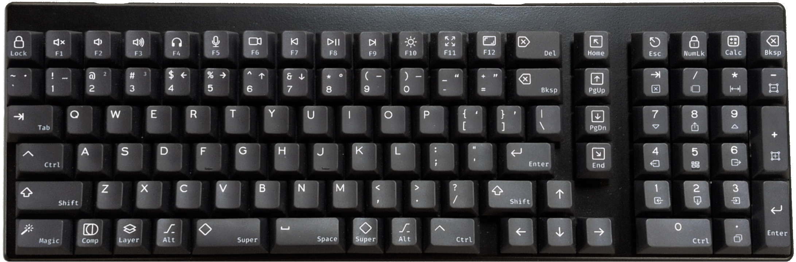
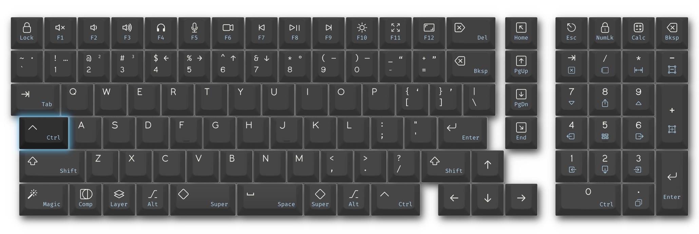
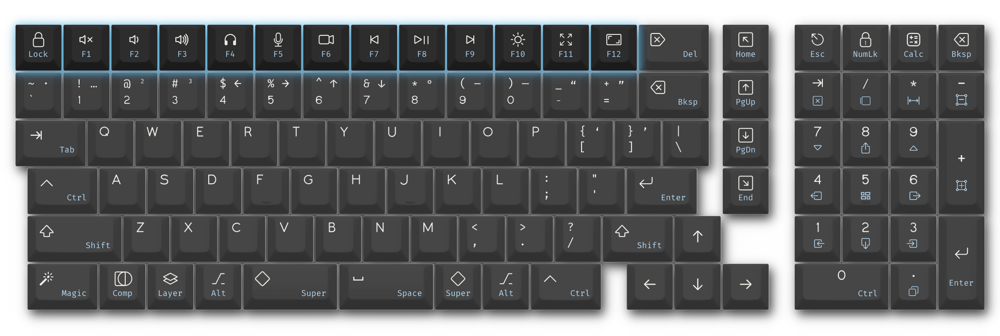
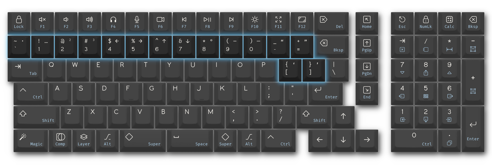
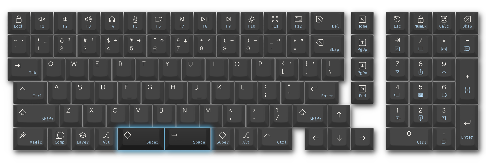
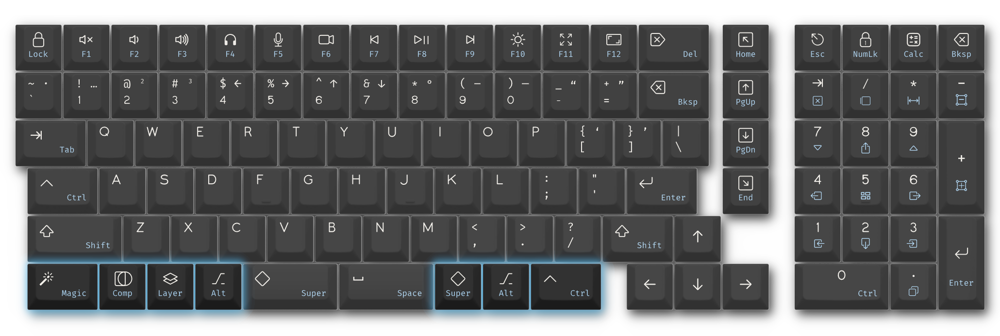
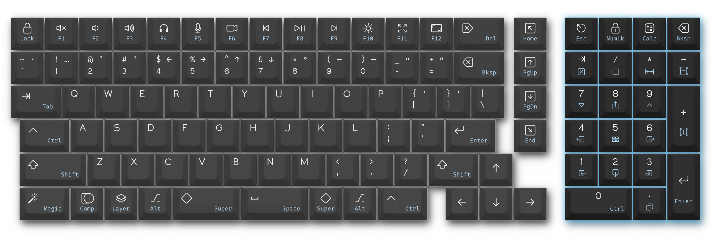

{: style="max-width: 800px"}

After switching to [niri](https://github.com/niri-wm/niri) a few months back, I found myself wanting a better keyboard layout that made access to `Ctrl` (for app-level shortcuts) and `Super` (for OS commands) highly accessible. My old keyboard (a Das Keyboard Model S that I got off craigslist) was perfectly adequate, but I wanted to explore the options for a more customized configuration.

This led me down a bit of a rabbit hole, but I was pleased with the result, so I thought I'd share.

# Goals

Before choosing a keyboard or layout, I had a number of different goals I was aiming towards:

* **Fewer unused keys**: `Scroll Lock` and `Pause Break` aren't necessary for me
* **Comfortable access to modifiers**: `Ctrl` and `Super` being the priorities
* **vim keybind support**: I don't use vim itself that often, but I set other editors to use vim keybindings, so need `Esc` to be easily accessed
* **niri navigation tools**: the default bindings for manipulating windows and workspaces are fine, but easier access would be better
* **Better data entry numpad**: numerical entry is much easier with a numpad, but the numpad lacks any other data entry keys
* **Useful F-row shortcuts**: media/hardware controls configured to what I use most frequently
* **Close to standard layouts**: this is partially for anyone else who might need to use my keyboard, but also because I use other keyboards and don't want to have wildly different muscle memory

# Hardware and Software

I ended up purchasing a System76 Launch Heavy. I was also considering the Keychron Q13 Pro, but I don't like using a wrist rest, and it looked too tall to use without one.

The keycaps were from Yuzu, planned with their custom design tool.

The software configuration was primarily achieved through a custom QMK keymap and my niri `config.kdl` file, though I use `keyd` for running a few custom scripts to handle some of the F-key shortcuts.

# Key Configuration

## Replacing Caps-Lock

{: style="max-width: 800px"}

I do actually use `Caps Lock` with moderate frequency. Mostly for data input or similar where all-caps is expected, less so for yelling on the internet. Still, the idea of reserving the prime real-estate of its typical position for these obscure use-cases is absurd. I chose to replace this with a [Mod-Tap](https://docs.qmk.fm/mod_tap) `Ctrl`/`Esc` button. `Ctrl` for easy keyboard shortcuts (much more comfortable than reaching down with the pinky to either of the typical `Ctrl` locations) and `Esc` for vim-style input and for controlling focus.

While vim-style editing was my initial reasoning for adding the `Esc` key here, it's remarkably useful beyond that. I've found numerous instances of interfaces where exiting a certain focus requires either using the mouse or pressing `Esc` (for example, using `Ctrl-f` on chrome brings up a search with the keyboard, but `Esc` is required to exit search).

I did keep `Caps Lock` readily available as `Shift+Shift`. Hard to do accidentally, but easy to remember when needed.

## Function Key Row

{: style="max-width: 800px"}

I opted to dedicate the top row to common shortcuts and controls, moving the F-keys to a secondary layer. I always liked the idea of having easy access to controls, but my experience has always been similar to when TV remotes have dedicated buttons to specific smart-applications or services: cool if you use those a lot, but wasted if they're not tuned exactly to your needs.

Customizing these helped focus on what I actually use most frequently, but I also tried to keep them generic enough to not be specific to my hardware or software. Hopefully the icons are self-explanatory for most, but here's the list:

* Screen Lock
* Mute
* Volume down
* Volume up
* Swap audio output (headphones/speakers)
* Mute/Unmute microphone
* Hide/Unhide camera
* Media back
* Media play/pause
* Media forward
* Backlight toggle
* Full screen toggle
* Print-screen

## Extra Symbols

{: style="max-width: 800px"}

There are a handful of symbols that I appreciate having quick access to beyond those typically present on a keyboard. I've used the degree symbol (°) enough that I don't have to look up that it's `U+00B0` (or `Alt+0176` on windows). Having direct access to that and a few other common symbols without having to look them up is a nice perk that doesn't really cost anything except some slightly more cluttered keycaps. I probably only needed a few of these, but opted to add:

* center dot: `·`
* ellipsis: `…`
* superscript 2 and 3: `²` and `³`
* arrows: `← → ↑ ↓`
* degree symbol: `°`
* en and em dashes: `–` `—`
* open and closing double and single quotes: `“ ”` and `‘ ’`

## Split Space Bar

{: style="max-width: 800px"}

This was one of the key features I was looking for when trying to find a keyboard. I type spaces almost exclusively with my right thumb, and wanted to enable using my left thumb for a common modifier. Since I already had `Ctrl` in the typical `Caps Lock` location, I opted to let my left thumb act as a `Super` modifier. I have all my window/workspace navigation keybinds using `Super`, along with a few other shortcuts for things like [albert](https://albertlauncher.github.io/).

I tried this for a bit, and very much liked it, but opted to change the left key to a Mod-Tap `Super`/`Space` as I found myself still wanting to type a space with my left thumb on occasion, usually if my right hand was using the mouse.

## Bottom Row

{: style="max-width: 800px"}

I actually kept most of the bottom row fairly standard. I don't use the bottom right mod keys very often, so left them to a fairly standard set of `Super`, `Alt`, and `Ctrl`. I left the left `Alt` key the same for `Alt-Tab` navigation, but the other three keys are a bit more interesting.

### Layer

This is mostly for toggling the F-key row between their media/shortcut uses and standard F-keys, but I opted not to call it `Fn` since I also use that layer to have access to some less common keys like `Insert`, or `Scroll Lock` (in the rare case an application has a need for those specifically).

### Compose

While I'm unfortunately monolingual, I have actually found myself getting a ton of use out of the compose key. I appreciate being able to easily spell names with their proper diacritics, and, as I've recently been learning a bit about Old English, having quick access to þ, ð, or æ has saved a lot of annoying copy-and-pasting when looking up words or phrases.

### Magic

This one's just a bit of fun, and I might swap this out for something else later, but it currently launches [Hexecute](https://github.com/ThatOtherAndrew/Hexecute). I also have it set as Mod-Tap for use as an extra `Ctrl` key. This is mostly so anyone else (or myself) using the keyboard will find their copy/paste muscle memory working.

## Numpad

{: style="max-width: 800px"}

Like a standard numpad, it has two modes controlled by a `Num Lock` key: one for data entry and another for window navigation. (the key actually toggles a custom layer, not actually sending numlock, but the labelling made sense)

### Number Mode

Three noteworthy tweaks here, all related to navigation when performing data entry (or other calculations):

* `Tab`: using the `Enter` key for submitting a typed number can cause problems with accidental form submission or navigating downwards in a spreadsheet instead of horizontally. Easy access to the `Tab` key allows for one-handed spreadsheet entry in both dimensions.
* `Esc`: when modifying a spreadsheet cell, if I want to undo a current edit, `Esc` will both undo any incomplete changes and stay focused on the current cell.
* `Backspace`: the main `Backspace` key isn't far from the number pad, but having it in the corner makes it easy to jump to while typing.

### Window Navigation

I do most window/workspace navigation using gestures on a touchpad, but I appreciate having a dedicated, single-handed option for all window movement and resizing options.

In this mode I have the `0` key set as a `Ctrl` modifier, which allows for an impressively large array of operations:

* Selecting windows (left, right, up, down)
* Moving windows (left, right, up, down)
* Merging/unmerging windows (left, right)
* Switching Workspaces (up, down)
* Moving windows to a different workspace (up, down)
* Cycling between default window sizes
* Growing/Shrinking windows (vertically, horizontally)
* Toggling tiling vs floating for a window
* Toggling tabbing for merged windows
* Closing a window

This is just about the full range of niri window commands, all usable one-handed!

# Impressions

I've very much enjoyed feeling in control of the design decisions for a device I use so often. Uniformity for something as pervasive as keyboards is still valuable, but it's a wonder to me that certain standards (like the `Caps Lock` location or the inclusion of `Pause Break`) have persisted.

I did make one minor revision already: I originally had the 'close window' key not require any modifier, and exited applications accidentally a few times. Thankfully, that was just a software fix to fix.

I also did purchase a few additional keycaps in case I want to adjust in the future:

* 4 "Macro" keys if I opt to remove the `Home`, `Page Up`, `Page Down`, and `End` keys
* Dedicated keys for `Power` and `Menu`
* Different sizes for `Delete`, `Lock`, `Escape` and some modifier keys to allow reorganizing